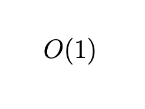
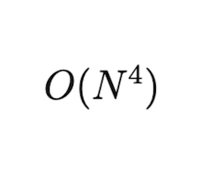
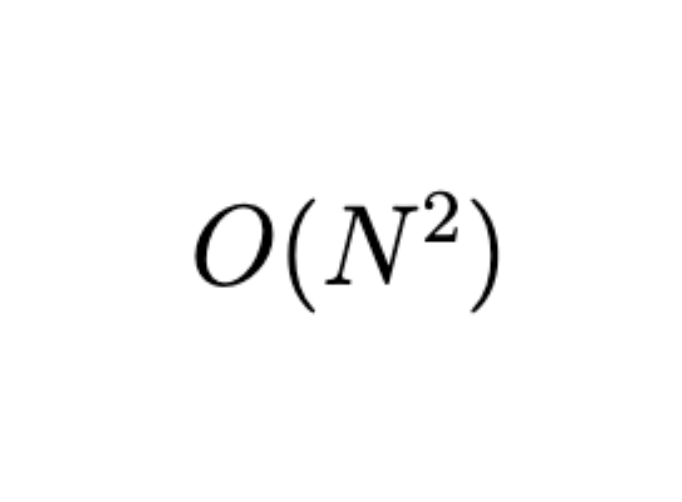
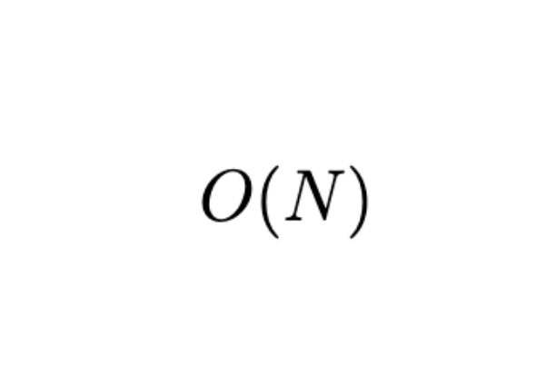
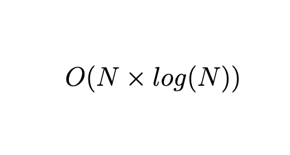
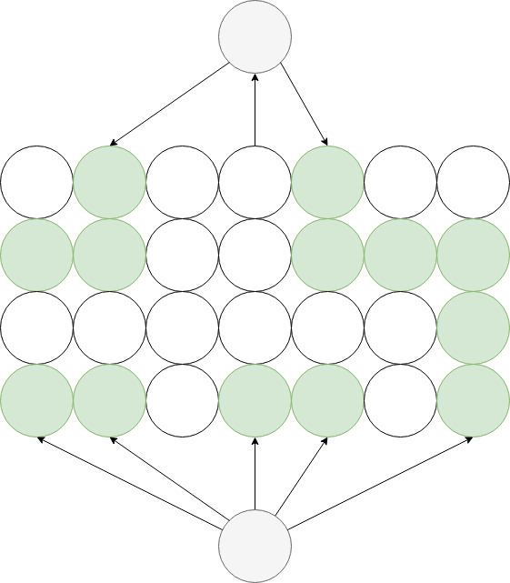
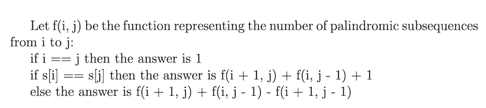

# Codeit - V4.0

## Introduction

- This repository contains all the solutions for the contest `Codeit v4.0`

## Solution Presentation

- **Note**: The solutions are presented in increasing order of difficulty (at least according to the judges 😅)

### Problem J:  Casino

- **Author** : Tarik Ed
- **Description**:
  - Amal bet p DHs. If she wins she receives 2p and returns to home, else she doubles her bet and play again.
- **Solution**:
  - let suppose she win at the n-th time, so W = -p -2*p -....-2^(n-1)*p + 2^n*p = -p -2^(n)*p + 2^n*p = p
- **Complexity**:

  

### Problem D: We want to play a game
- **Author** : Tarik Ed
- **Description**:
  - Representation in d is fancy if `n % d == 3`, `d` is fancier if there are minimum of consecutive zeros after the `3`
- **Solution**:
  - For every divisor `d>4` of `n - 3` store the largest power of d in a list, then take the smallest value.
- **Complexity**:

### Problem I: Triangles and stuff
- **Author** : Mouad
- **Description**:
  - Given the coordinates of two points A and Bin the 2D plan. you need to find another 3rd point C such that the triangle ABC is equilateral. Print the point with the minimal x and maximal y in case of time.
- **Solution**:
- **Complexity**:

  

### Problem E: Probable Cake
- **Author** : Azuz
- **Description**:
  - Given the width and the height of a rectangle and a value A, After performing two horizontal cuts and two vertical cuts at random points inside the rectangle such that the cuts devides it into 9 sub rectangles, what is the probability that one of these sub rectangles is greather than or equals to A.

- **Solution**:
  - Each vertical and horizontal cut will interect in one point inside the rectangle. You can simply keep moving the first point inside the rectangle and the second point to the right and bottom of the other point, and count the total number of checked points and the total number of valid positions.

  - The answer is the total number of valid positions devided by the total number of checked positions.

  - Note that not restricting the search to the right bottom of the first point might result on A TLE.

- **Complexity**:

  

### Problem B: Wrap Up

- **Author** : Azuz
- **Description**:
  - Given a set of points in the 2D points, you need to remove one point such that the area of the resulting convex poylgon is the minimal Possible.
- **Solution**:
  - One brute force solution is to compute the convex hull without considiring one point at each time. The complexity of this approach is _O(n² log(n))_. This Solution solution is not the entended solution and might give TLE.
  - Another way to approach this problem is by noticing that to compute the convex hull in _O(n log(n)_ complexity you need to use graham can algorithm which sort the points based on their polar angle in counterclockwise order around the bottom left point and their distance from this point in case of tie. The second part of the graham scan algorithme runs in O(n). So The idea is to notice that there is no need to resort the points while removing a point different from the bottom left one (say p0), and simply run the second part of graham scan.
  - Note that you should not forget to consider removing the bottom left point and rerun _O(n log(n))_ convex hull algorithme to compute the area.
- **Complexity**:

  

### Problem H: Houda and kindergarten students
- **Author** : Mehdi
- **Description**:
  - Problem asks simply to compute the sum of happiness value of every subset. the happiness is defined as the diff between the maximum and minimum value of every subset

- **Solution**:
  - The observation is having all values sorted, then value at i'th position is going to be max for all i subsequences before it and minimum for n - i - 1 subsequences after it . so all we need is sum of a[i]*(2^i * a[i] - 2^(n - i - 1)) over all i.
  - Since the problem constraints are kind of big, you should do a sort in linear time, counting sort will do the trick here

- **Complexity**:
  

### Problem C: Schoolarship

- **Author** : Tarik Ed
- **Description**:
    - Read problem statement
- **Solution**:
    - Implementation of stable marriage problem.
- **Complexity**:
  

### Problem G: Palindrome Paths

- **Author** : Mouad
- **Description**:
  - given a tree, find number of paths having plaindrom strings
- **Solution**:
    - Store at each node, the number of occurrences of each string from root to he vertices in the subtree of that node.
And do a DFS to find the answer to the problem. The naive algorithm would result in MLE or TLE O(n^3)
You can speed it up a bit using String Hashing (double hashing to avoid anti simple hashing tests) and complexity would be O`(N^2)`

To speed it up even more, you could use DSU on Trees to make it O(n * log^2(n)) which is the intended solution.

- **Complexity**:

  

### Problem A: Houda and labyrinth game

- **Author** : Mehdi
- **Description**:
  - Given a 2D matrix with cells containing `0` and `1` answer two types of queries: make a given cell `1`, and tell if
    it's possible to reach the bottom row from the top row going only by adjacent white cells .

- **Solution**:
  - One approach is to update evey cell, and do a `dfs` for every query to answer the second type of query, and this will timout
  - Another approach was to consider every cell in the grid as a node in a graph that has no edges and link every adjacent
    `1` cell using a `Disjoint set` and you can answer the second query by checking if the top row and the last row are in the
    same connected component . in the worst case this will timeout .
  - The intended approach is a slight optimization of the above, make two that aren't part of the grid, one at the top and the other at the bottom . and check if those two are in the same connected component . check the illustration two get it .

  - 

- **Complexity**:

  

### Problem F: Palindrome Subsequence Strings

- **Author** : Mouad
- **Description**:
    - Given a string s, count the number of subsequences that form a palindrom .
- **Solution**:
- It's a simple DP problem, turned out inside the contest that this problem is already explained in this [link](https://www.geeksforgeeks.org/count-palindromic-subsequence-given-string/)

There are many DP approaches to this problem, but the idea is to get an algorithm of complexity `O(N^2)` or less.

  

- **Complexity**:

  

